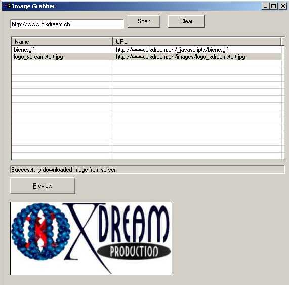



## All Web Images

### Description

Web Image is a full working image graber for webpages. You enter the url, Web Image will download and parse the sourcecode and list all available images. Afterwards, you can download and save the files individually by clicking preview. Because Web Image is just downloading the sourcecode, it's pretty fast. Sourcecode is well commented. Check it out and rate if you like it :)
 
### More Info
 

             |
---                |---
**Submitted On**   |2003-06-20 05:30:02
**By**             |[Xdream](https://github.com/Planet-Source-Code/PSCIndex/blob/master/ByAuthor/xdream.md)
**Level**          |Intermediate
**User Rating**    |4.6 (41 globes from 9 users)
**Compatibility**  |VB 5\.0, VB 6\.0
**Category**       |[Graphics](https://github.com/Planet-Source-Code/PSCIndex/blob/master/ByCategory/graphics__1-46.md)
**World**          |[Visual Basic](https://github.com/Planet-Source-Code/PSCIndex/blob/master/ByWorld/visual-basic.md)
**Archive File**   |[Web\_Image1603496202003\.zip](https://github.com/Planet-Source-Code/xdream-all-web-images__1-46319/archive/master.zip)

